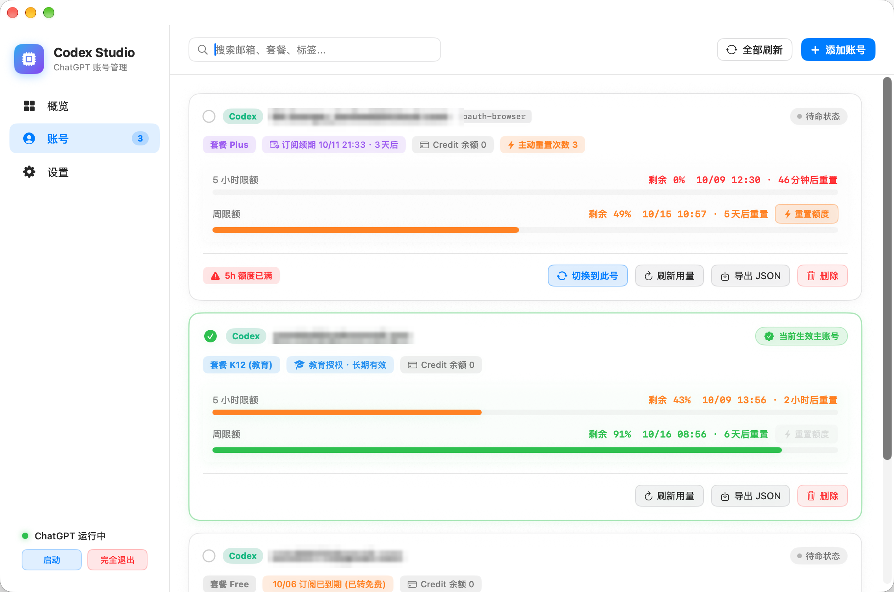
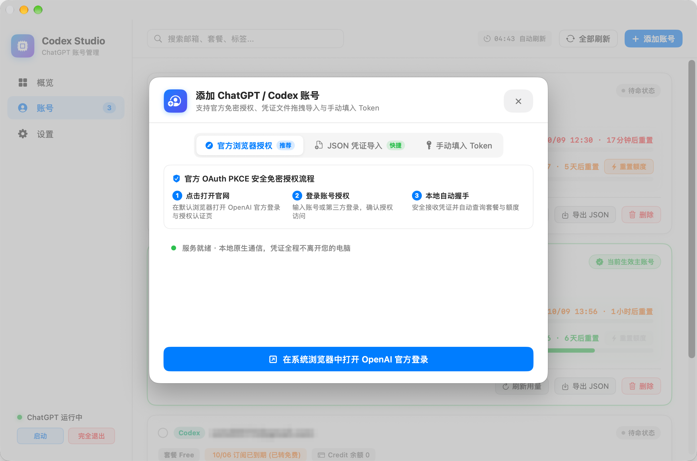
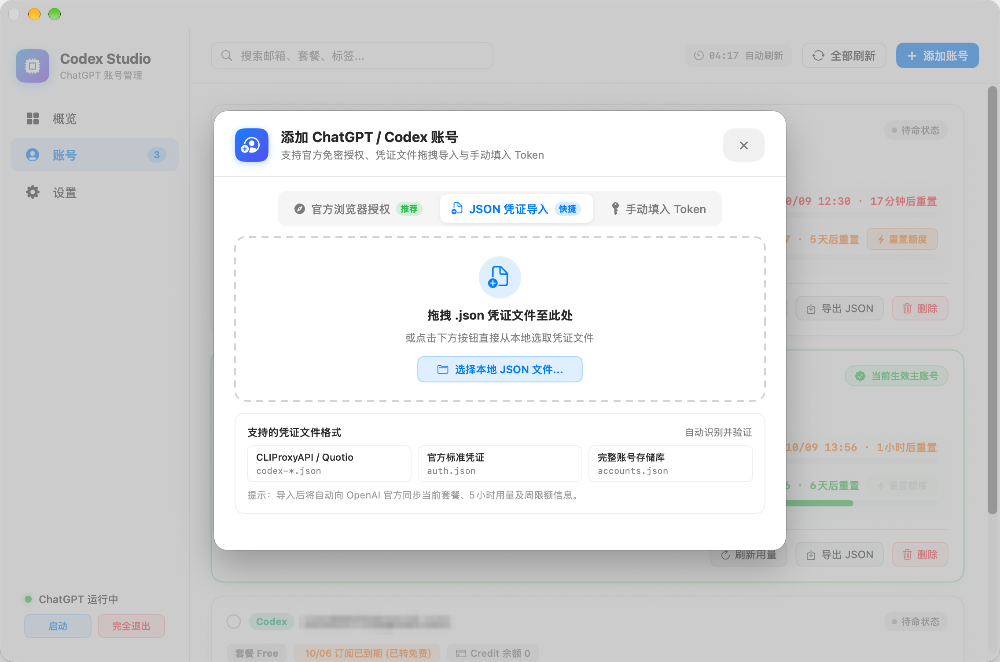

# Codex Studio 🚀

<p align="center">
  
</p>

<p align="center">
  <b>专为 macOS 打造的原生 ChatGPT / Codex 多账号管理与额度监控工具</b>
</p>

<p align="center">
  
  
  
  
</p>

---

## 📖 简介

**Codex Studio** 是一款专为 macOS 设计的现代化原生桌面客户端。针对 ChatGPT / OpenAI Codex 深度定制，融合了便捷的多账号管理、一键安全切号、官方实时用量监控与自动刷新功能。

采用 **纯原生 Swift + SwiftUI + AppKit** 打造，零外部依赖（不需要 Node.js、Python 或 Java 环境），极速秒启、低内存占用，深度遵循 Apple HIG 人机交互设计规范。

---

## 📸 界面预览

### 主界面与实时额度卡片


### 官方浏览器免密授权 (OAuth PKCE)


### 凭证文件拖拽导入


---

## 🌟 核心特性

- **⚡ 官方实时用量与额度监控**
  - 直连 OpenAI 官方用量接口，精准获取 **5 小时限额剩余量** 与 **周限额剩余量**。
  - 动态计算并实时秒级倒计时（如 `31分钟后重置`、`1小时后重置`）。
  - 支持 **主动重置次数消耗**：针对支持额度重置的账号，提供一键重置将 5 小时限额回满至 100%。
  - 全方位套餐状态识别：自动识别 Plus、K12 教育授权、Pro、Team、Free 套餐及订阅续期日期。

- **🔄 后台定时自动刷新**
  - 支持后台周期性自动同步官方用量，默认 5 分钟（可在设置中自由调节 2 / 5 / 10 / 15 / 30 分钟）。
  - 顶部栏实时展示距离下次刷新的倒计时胶囊。

- **🔐 3 种便捷的账号接入方式**
  1. **官方浏览器授权 (OAuth PKCE)**：一键在默认浏览器打开 OpenAI 官网登录，本地临时端口（1455）安全握手回调，免复制粘贴。
  2. **拖拽 & 文件导入**：支持将 CLIProxyAPI (`codex-*.json`)、Quotio、官方标准 `auth.json` 或完整 `accounts.json` 拖入窗口一键解析。
  3. **手动 Token 录入**：支持手动粘贴 Refresh Token，自动向官方换取最新凭证与 JWT 解析。

- **🔀 一键智能安全切号**
  - 切号时自动向 OpenAI 官方刷新有效 Access Token，更新本地 `~/.local/share/codex-account/accounts.json` 与 `~/.codex/auth.json`。
  - **进程级安全联动**：切号前自动平滑退出当前运行中的官方 ChatGPT 桌面端，切换凭证后自动重新拉起，彻底杜绝缓存覆盖冲突。

- **🍏 Universal 2 通用架构**
  - 原生支持 **Apple Silicon (M1/M2/M3/M4)** 以及 **Intel (x86_64)** Mac。
  - 零外部运行依赖，即装即用。

---

## 📥 安装与运行

### 方式一：下载 Release 预编译包（推荐）
前往 [Releases](../../releases) 页面下载最新的 `Codex-Studio-v1.0.0-macOS-Universal.dmg`：
1. 双击打开 DMG 镜像；
2. 将 `Codex Studio.app` 拖入 `Applications` 应用程序文件夹；
3. **若打开提示“已损坏，无法打开”或“无法验证开发者”**：
   - 双击 DMG 镜像内自带的 **「一键解除已损坏提示.command」** 脚本；
   - 或在终端执行：
     ```bash
     xattr -cr "/Applications/Codex Studio.app"
     ```

### 方式二：从源码本地编译
确保您的 Mac 安装了 Xcode 或 Command Line Tools (macOS 13.0+)：

```bash
# 1. 克隆代码仓库
git clone https://github.com/<your-username>/codex-studio.git
cd codex-studio

# 2. 一键编译并打包 (自动生成 Universal 2 架构与 DMG 镜像)
./build.sh
```

编译完成后应用将自动安装至 `/Applications/Codex Studio.app`，安装包位于 `dist/` 目录下。

---

## 🔒 隐私与安全说明

- **完全本地化**：Codex Studio 是纯本地桌面软件，所有账号凭证仅保存在您本机的 `~/.local/share/codex-account/` 目录下。
- **无中间代理**：OAuth 授权和用量查询仅直接与 OpenAI 官方服务器 (`auth.openai.com` / `chatgpt.com`) 进行 HTTPS 通信，没有任何第三方服务器中转。

---

## 📄 开源许可证

本项目基于 [MIT License](LICENSE) 开源。欢迎 Star、提 Issue 或提交 Pull Request！
